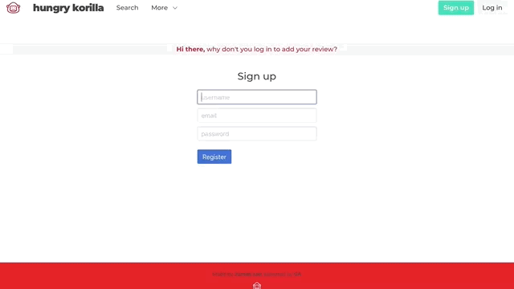

<!-- <a></a>
 -->
# hungry korilla

## GA Project 2
This was the second project assignment during my time on the Web Development Immersive course (12 weeks of full-time) at General Assembly. The project took place in the week 6.

**Note**
- The app is not yet fully responsive. For best experience open on the laptop.
- The landing page may take longer than the average page load time.

#### Course Curriculum :

> **Week 5** | Module Two

- Node.js
- Express.js
- EJS
- MongoDB
- User Authentication

*Full curriculum available at the bottom of the page.*

***

## Brief
Design a full-stack Node app that must include:
* At least two models.
* At least one embedded or referenced schema.
* A persistent database (with all CRUD actions on records).
* User authentification (registration and session creation).
* RESTful routes.
* EJS for template creation.
* A CSS framework on the front-end.
* Deployed on Heroku.

**Timeframe :** 1 week (October 2018)

## Concept
There were three options to choose from: Mock-Instagram or Medium or restaurant review site. I chose the last.
'hungry korilla' is a Korean restaurant review site. The app allows users to Search Korean restaurants filtered by city and also user can post their favourite restaurants.

## Goal
Understand fundamentals of back-end web development and building a full-stack web application using Node.js.

## Visuals
##### User Authentication


##### Search by city


##### Add Review


## Project Log
#### Approach
| Time    | Action                                              |
| ------- |:---------------------------------------------------:|
| Day 1   | Project concept, code planning                      |
| Day 2   | Initial file setup                                  |
| Day 3   | Models + data and routes - Index, Show              |
| Day 4   | Routes and forms - New, Create, Edit, Update, Delete|
| Day 5   | Style                                               |
| Day 6   | Bug fixing and deployment                           |
| Day 7   | Presentation                                        |

#### Challenges
From the experience of [my first project](https://github.com/Jumee-LDN/wdi-project-one) I knew it was crucial to get to MVP as soon as possible. With that in mind, I:
* Created a list of all the features I wanted to create.
* Created a site structure.

It was tricky to set routes as I wanted to filter restaurants by city and show on the index page. I made a route to render the index page based on input form on the homepage.
```javascript
router.post('/cities', restaurantController.filterByCity);
```
`restaurantController.filterByCity` takes input from the form, and redirect url with city name(value from html form).
```javascript
function restaurantFilterByCity(req, res) {
  res.redirect(`/restaurants/city/${req.body.city}`);
}
```

#### Lessons learned
It is important to quickly try the routes and models to see an approach is feasible. Planning a practical structure is possible when a reasonable amount of experience and knowledge are gained.

## Bugs / Moving Forward
- Search bar is not case flexible.
- Any logged in user can edit-delete the posts.
- User can upload only one image per post. 

## Technologies Used

* JavaScript (ECMAScript6)
* Node.js
* Express.js
* EJS
* MongoDB
* HTML5
* CSS3
* Bulma
* GitHub

## License

[](http://badges.mit-license.org)

- **[MIT license](http://opensource.org/licenses/mit-license.php)**

***

## Course Curriculum
Please see below for the details of my training and links to more projects.

> **Week 1-3** | Module One

- HTML5
- CSS3 and CSS Animation
- Sass
- JavaScript
- jQuery

> **Week 4**

- *Project 1* : **Iguana vs Snakes** | [GitHub](https://github.com/Jumee-LDN/wdi-project-one) |
[Play Link](https://jumee-ldn.github.io/wdi-project-one/)

> **Week 5** | Module Two

- Node.js
- Express.js
- EJS
- MongoDB
- User Authentication

> **Week 6**

- *Project 2* : **hungry korilla** | [GitHub](https://github.com/Jumee-LDN/wdi-project-two) |
[Heroku](https://hungrykorilla.herokuapp.com/)

> **Week 7-8** | Module Three

- AngularJS
- Token Authentication & Session Authentication
- Third-party APIs
- Mocha and Chai

> **Week 9**

- *Project 3* : **xhibit** | [GitHub](https://github.com/Jumee-LDN/wdi-project-3) |
[Heroku](https://xhibit.herokuapp.com/#!/)

> **Week 10-11** | Module Four

- React
- JSX
- ES6

> **Week 12**

- *Project 4* : **Nomad** | [GitHub](https://github.com/Jumee-LDN/wdi-project-four) |
[Heroku](https://nomad-ga.herokuapp.com/)

***

## Contact
#### Jumee Lee
Email : jumeelee.london@gmail.com

[Portfolio]() | [LinkedIn](https://www.linkedin.com/in/jumeelee/) | [GitHub](https://github.com/Jumee-LDN)
